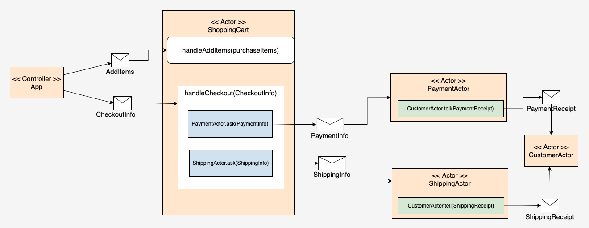

# Jill's Juice
The project demonstrates the modes of message communication in the Actor model.

# To run

```
mvn compile exec:exec
```

# Understanding the demonstration application

This GitHub project shows how to implement the Actor Model as a simple shopping cart for Jill’s Juice, a fictitious e-commerce company that sells a variety of gourmet juices. The implementation uses the Akka framework under Java.



The shopping cart is represented by an actor called the `ShoppingCartActor`. The client that sends messages into the `ShoppingCartActor` is a controller actor called `App`.

The App actor sends a fire-and-forget `AddItems` message that describes a set of items to add to the `ShoppingCartActor`. Another fire-and-forget message named `CheckoutInfo` describes the checkout information required to execute checkout behavior within the `ShoppingCartActor`. Sending a `CheckoutInfo` to the `ShoppingCartActor` instigates the checkout process. (See Figure 2, callout 1.)

The checkout process within the `ShoppingCartActor` sends a response message to the `PaymentActor` which processes payment and returns a response. (See Figure 2, callout 2a.) After the `PaymentActor` processes payment it sends a fire-and-forget `PaymentReceipt` message to the `CustomerActor`. (See Figure 2, callout 3a.)

After payment is made and acknowledged by a response from the `PaymentActor`, the `ShoppingCartActor` sends a `ShippingInfo` message to the `ShippingActor`. (See Figure 2, call out 2b.) The `ShippingActor` ships the items described in the ShippingInfo message. The `ShippingActor` responds to the `ShoppingCartActor` letting it know that shipment has executed. Also, the `ShippingActor` sends a fire-and-forget `ShippingReceipt` message to the `CustomerActor` to inform the customer that the items have shipped. (See Figure 2, callout 3b.)
